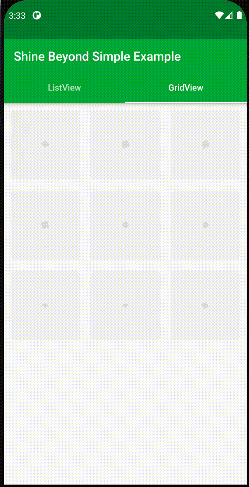
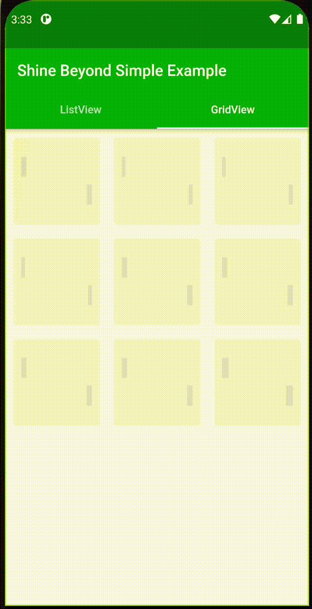

# Shine Beyond

[Github - Mahammad Bakr](https://github.com/mahammadbakr)

Shine Beyond Package Used to make various type of animated designs
For your List & Grid Views data when fetches and loading,
One of the Advantages of using this Packages is You don't have to take a
long time to organize and create animated widgets.

***

**Steps To Use the Package:**

**STEP 1:**

Go to Package and get in to Installing section, Then Copy the dependency Code.

**STEP 2:**

Go to "pubspec.yaml" of your project and paste it under the dependencies section.

**STEP 3:**

Add these lines of code in to your ListView or GridView Screen:
```dart
  var isLoading = true, isStarted = false;
  @override
  void initState() {
    if (!isStarted) {
      _getDataInToList();
    }
    isStarted = true;
    super.initState();
  }
  Future _getDataInToList() async {
    Future.delayed(Duration(seconds: 2), () {
      _list = widget.list;
      setState(() {
        isLoading = false;
      });
    });
  }
```


**STEP 4:**

Initialize ShineGridLoader class in your Code and send your List or GridView
And Send "CHILD" parameter just like below:

- Body Section For Grid View:

```dart
 return isLoading ?
      return ShineGridLoader(
        child: ShineGridWidget(itemCount:itemCount, gridWidgetType: GridWidgetType.tween,duration: Duration(milliseconds: 20)),
        itemCount: itemCount,
        highlightColor: Colors.lightGreen[300],
        direction: ShineDirection.ltr,
      ) :
      return GridView.builder(
        itemBuilder: (ctx, i) {
           Object object = _list[i];
          return  Text(object.name);
        },
        itemCount: itemCount
      );
```

- Body Section For List View:

```dart
 return isLoading ?
      return ShineListLoader(
        child: ShineListWidget(itemCount:itemCount, listWidgetType: ListWidgetType.mix,duration: Duration(milliseconds: 20)),
        itemCount: itemCount,
        highlightColor: Colors.lightGreen[300],
        direction: ShineDirection.ltr,
      ) :
      return ListView.builder(
        itemBuilder: (ctx, i) {
           Object object = _list[i];
          return  Text(object.name);
        },
        itemCount: itemCount
      );
```

Now Run Your Application and see the Results...

**Note that:**
- "ShineListLoader" works with (ShineListWidget and ListWidgetType).
- "ShineGridLoader" works with (ShineGridWidget and GridWidgetType).

***

**Some Examples of Package Usage:**

1- GridView - rotation



2- GridView - beating


3- GridView - tween



4- ListView - mix


5- ListView - rectangular


6- ListView - box


[GitHub - Mahammad Bakr](https://github.com/mahammadbakr)
[GitLab - Mahammad Bakr](https://gitlab.com/mahammadbakr77)
[Facebook - Mahammad Bakr](https://www.facebook.com/mahammad.bakr/)
[Facebook - Exon Tech](https://www.facebook.com/ئیخۆن-تێک-Exon-Tech-108372014244214)
**Email:** MahammadBakr77@gmail.com
**Phone:** +9647502289291
