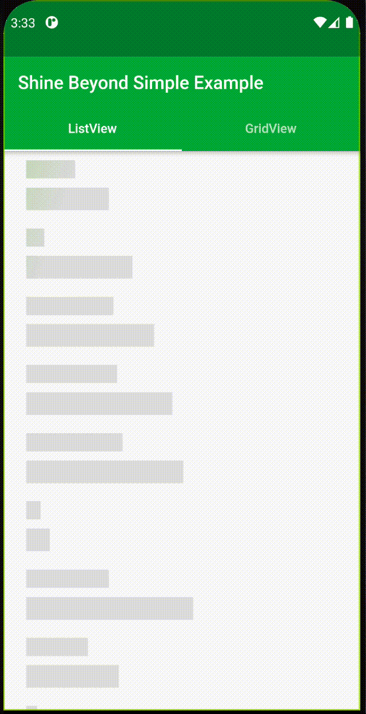

# shinebeyond

[Github](https://github.com/mahammadbakr"Github home")

Shine Beyond Package Used to make various type of animated designs
For your List & Grid Views data when fetches and loading,
One of the Advantages of using this Packages is You don't have to take a
long time to organize and create animated widgets.


**Steps To Use the Package:**
STEP 1:
Go to Package and get in to Installing section, Then Copy the dependency Code.

STEP 2:
Go to "pubspec.yamel" of your project and paste it under the dependencies section.

STEP 3:
Add these lines of code in to your ListView or GridView Screen:
```dart
  var isLoading = true, isStarted = false;
  @override
  void initState() {
    if (!isStarted) {
      _getDataInToList();
    }
    isStarted = true;
    super.initState();
  }

  Future _getDataInToList() async {
    Future.delayed(Duration(seconds: 3), () {
      _list = widget.list;
      setState(() {
        isLoading = false;
      });
    });
  }
```


STEP 4: Initialize ShineGridLoader class in your Code and send your List or GridView
And Send "CHILD" parameter just like below:

- Body Section For Grid View:
```dart
 if (isLoading) {
      return ShineGridLoader(
        child: ShineGridWidget(itemCount:itemCount, gridWidgetType: GridWidgetType.tween,duration: Duration(milliseconds: 20)),
        itemCount: itemCount,
        itemsPerRow: 3,
        shrinkWrap: true,
        period: Duration(seconds: 2),
        highlightColor: Colors.lightGreen[300],
        direction: ShineDirection.ltr,
      );
    } else {
      return GridView.builder(
        itemBuilder: (ctx, i) {
          Synonym synonym = _synonymsList[i];
          return Card(
            child: GridTile(
              child: Column(
                mainAxisAlignment: MainAxisAlignment.center,
                children: <Widget>[
                  Text(synonym.name),
                  Text(synonym.synonym),
                ],
              ),
            ),
          );
        },
        itemCount: itemCount,
        shrinkWrap: true,
        physics: NeverScrollableScrollPhysics(),
        gridDelegate: SliverGridDelegateWithFixedCrossAxisCount(
          crossAxisCount: 3,
        ),
      );
```

- Body Section For List View:
```dart
   if (_isLoading) {
      return ShineListLoader(
        child: ShineListWidget(listWidgetType: ListWidgetType.box,duration: Duration(milliseconds: 20)),
        items: 10,
        period: Duration(seconds: 2),
        highlightColor: Colors.lightGreen[300],
        direction: ShineDirection.ltr,
      );
    } else {
      return ListView.builder(
        itemBuilder: (ctx, i) {
          Synonym sc = _synonymList[i];
          return ListTile(
            leading: CircleAvatar(
              child: Text("${i + 1}"),
            ),
            title: Text(sc.name),
            subtitle: Text(sc.synonym),
          );
        },
        itemCount: _synonymList.length,
        shrinkWrap: true,
        physics: NeverScrollableScrollPhysics(),
      );
```

Now Run Your Application and see the Results...

Note that:
- "ShineListLoader" works with (ShineListWidget and ListWidgetType).
- "ShineGridLoader" works with (ShineGridWidget and GridWidgetType).


**Some Examples of Package Usage:**

1- GridView - rotation


2- GridView - beating


3- GridView - tween


4- ListView - mix


5- ListView - rectangular


6- ListView - box
